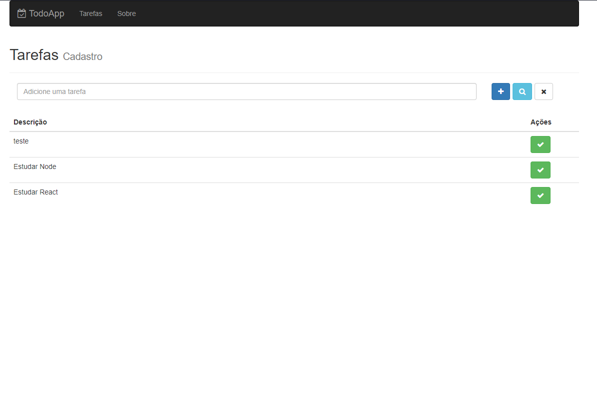
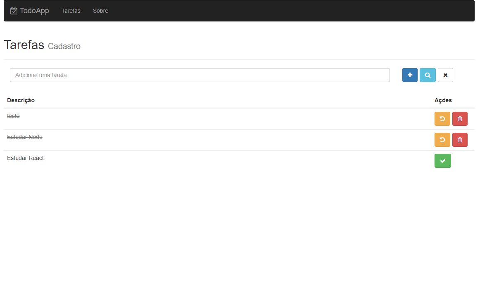
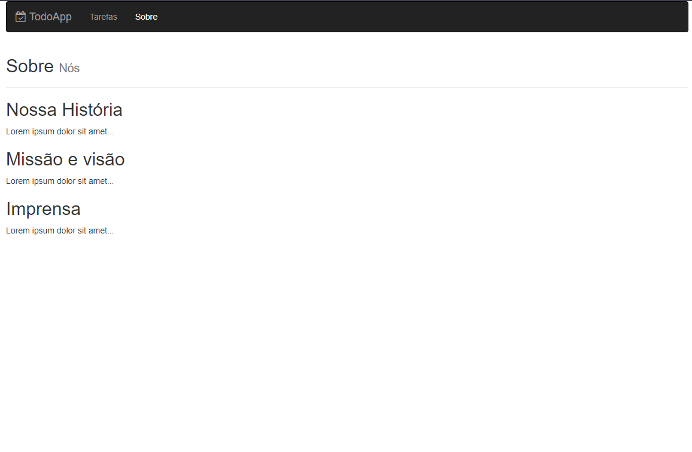

<!-- PROJECT LOGO -->
<br />
<p align="center">
  <a href="https://github.com/othneildrew/Best-README-Template">
    
  </a>

  <h3 align="center">App Todo-List</h3>

  <p align="center">
    Uma aplicação onde você pode criar tarefaz em sua nova check-list.
    <br />
    <a href="https://github.com/othneildrew/Best-README-Template"><strong>TODO CHECK-LIST</strong></a>
    <br />
    <br />
    <a href="https://github.com/lourencovitor/studying-reactjs/tree/master/todo-app/backend">Back-End</a>
    ·
    <a href="https://github.com/lourencovitor/studying-reactjs/tree/master/todo-app/frontend">Front-End</a>
  </p>
</p>

<!-- TABLE OF CONTENTS -->

## Conteúdos

- [Sobre o Projecto](#sobre-o-projeto)
- [Front End](#front-end)
- [Back End](#back-end)

<!-- ABOUT THE PROJECT -->

## Sobre o Projeto

Aplicação criada com intuito de aprendizagem, a aplicação serve para você criar uma nova tarefa e marcar como feita caso esteja feita, caso contrario pode desfazer isso
voltando tarefa para o estado de a fazer, conseguimos também excluir essas tarefaz criadas e pesquisar por eles.

<p align="center">

</p>
<p align="center">

</p>
<p align="center">

</p>

<!-- GETTING STARTED -->

## Front End

### Pre-requisitos

- <a href="https://nodejs.org/en/">Node.js</a>

### Instalação

1. Vá até <a href="https://github.com/lourencovitor/studying-reactjs/tree/master/todo-app">Repo</a>
2. Clone o repo

```sh
git clone https://github.com/lourencovitor/studying-reactjs/tree/master/todo-app
```

3. entre em /frontend

```sh
  cd /frontend
```

4. Instale os pacotes

```sh
npm install
```

5. Rode o projeto

```JS
npm run dev
```

## Back End

### Pre-requisitos

- <a href="https://nodejs.org/en/">Node.js</a>

### Instalação

1. Vá até <a href="https://github.com/lourencovitor/studying-reactjs/tree/master/todo-app">Repo</a>
2. Clone o repo

```sh
git clone https://github.com/lourencovitor/studying-reactjs/tree/master/todo-app
```

3. entre em /backend

```sh
  cd /backend
```

4. Instale os pacotes

```sh
npm install
```

5. Rode o projeto

```JS
npm run dev
```
